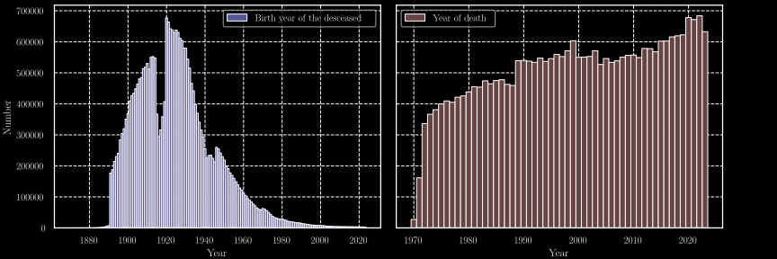
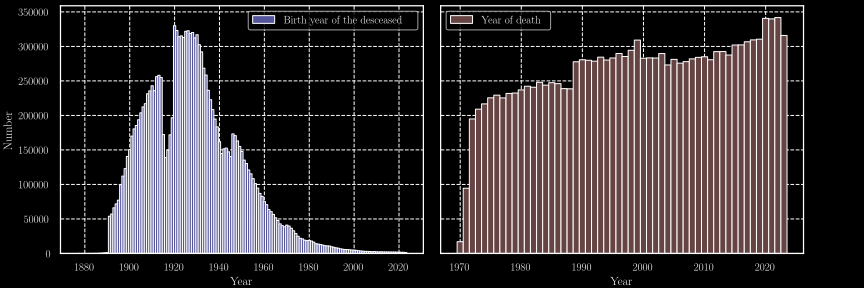
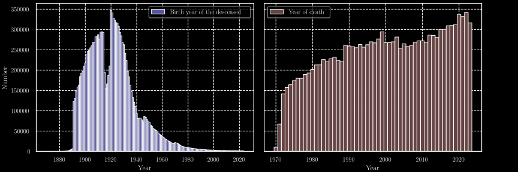
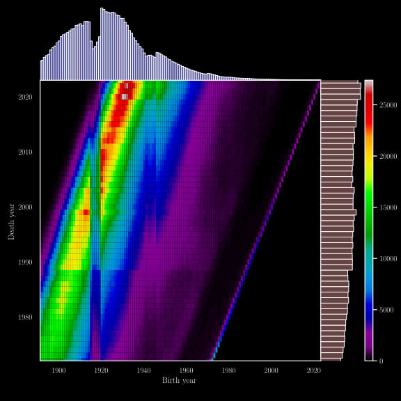
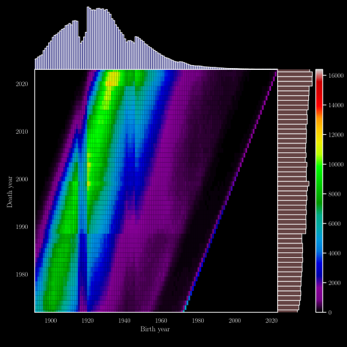
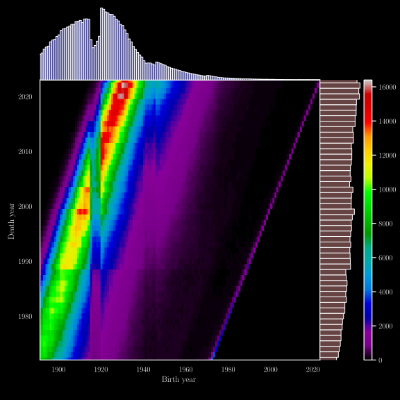

# Strange Years

This project involves parsing and analysing the French “Deceased Persons
File” from the [INSEE](https://www.insee.fr) database. We retrieved
these datasets using the API from the
[data.gouv.fr](https://www.data.gouv.fr) website.

## Introduction

This project is the culmination of a series of analyses that began
during the second lockdown in France, from 30 October to 15 December
2020. It initially stemmed from a casual discussion regarding the
various arguments against the implementation of public health measures.
The argument that led us to examine the data was as follows:

> **“The excess mortality during the COVID-19 pandemic is comparable to
> the cold epidemics of previous years in France, which did not require
> lockdown measures. The response to COVID-19 is, therefore, at the very
> least, an overreaction.”**

Following this discussion, we decided to use the skills we acquired
during our physics studies to test this claim using data. However, as we
experimented with different data analysis and visualisation methods,
what started as a playful inquiry soon evolved into something much more
profound than the initial question we had set out to answer. New
questions arose, and the following is the result of these explorations.

This work is the product of discussions, aesthetic choices, and both
insightful and less relevant observations. It is a work focused on
questions, more than answers.

> **“There are naive questions, tedious questions, ill-phrased
> questions, questions put forth after inadequate self-criticism. But
> every question is a cry to understand the world. There is no such
> thing as a dumb question.”**
>
> — *Carl Sagan, The Demon-Haunted World: Science as a Candle in the
> Dark*

To all those seemingly insignificant discussions that weave through our
lives, to the friends who engage with them, and to those who admit their
ignorance. Thank you to all of you who contributed to this work, from
the first moment to the long years when it gathered dust in the corners
of our minds.

To the countless curious minds that this work has intrigued, offering
their insights, questions, or simply their presence—thank you. To the
associations that brought us together, to the Discord conversations that
broke our isolation, and to the games that united us. A special thanks
to the association **CurieOsity**, whose name resonates in so many ways
within this work and intriguingly fits so well with the spirit of this
paper.

Finally, thank you **Guillaume Beaujard**, whose curiosity and questions
have inspired so many minds. Your first question, which started it all,
along with your enthusiasm, incisive insights, and kindness, have been
invaluable to this project.

## Brief Overview of the Dataset

The dataset contains the following fields:

- Surname
- First name
- Gender
- Date of birth
- Code of the locality of birth
- Name of the locality of birth
- Country of birth
- Date of death
- Code of the locality of death
- Code of the death certificate

Using the years of birth and death, we can plot the distributions over
time, as shown in figures figs. 1-3. The impact of the two world wars is
evident in the reduced number of births during the periods 1915-1919 and
1940-1945.

<figure id="fig:dist"
style="text-align: center; margin:auto; display: block">

<figcaption aria-hidden="true">Figure 1: Distribution of the years of
birth and death in the dataset</figcaption>
</figure>

<figure id="fig:M_dist"
style="text-align: center; margin:auto; display: block">

<figcaption aria-hidden="true">Figure 2: Distribution of the years of
birth and death for males</figcaption>
</figure>

<figure id="fig:F_dist"
style="text-align: center; margin:auto; display: block">

<figcaption aria-hidden="true">Figure 3: Distribution of the years of
birth and death for females</figcaption>
</figure>

We can also observe the relationship between birth year and year of
death in figures figs. 4-6. These figures display a line where the birth
year matches the death year, which can be easily attributed to infant
mortality.

Another noteworthy aspect is the presence of a “death peak”, which isn’t
surprising, as most people tend to die at an older age. However, the
dynamics of this peak are worth exploring further. The increase in life
expectency is shown by this dynamic, as the time goes the crest follows
curve whose directive coeficient is above 1. Thus the gap between birth
and death increase.

<figure id="fig:2D_dist"
style="text-align: center; margin:auto; display: block">

<figcaption aria-hidden="true">Figure 4: Distributions of year of death
given the year of birth</figcaption>
</figure>

<figure id="fig:M_2D_dist"
style="text-align: center; margin:auto; display: block">

<figcaption aria-hidden="true">Figure 5: Distributions of year of death
given the year of birth for males</figcaption>
</figure>

<figure id="fig:F_2D_dist"
style="text-align: center; margin:auto; display: block">

<figcaption aria-hidden="true">Figure 6: Distributions of year of death
given the year of birth for females</figcaption>
</figure>
