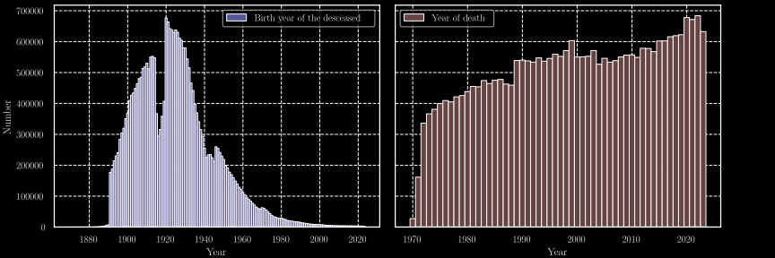
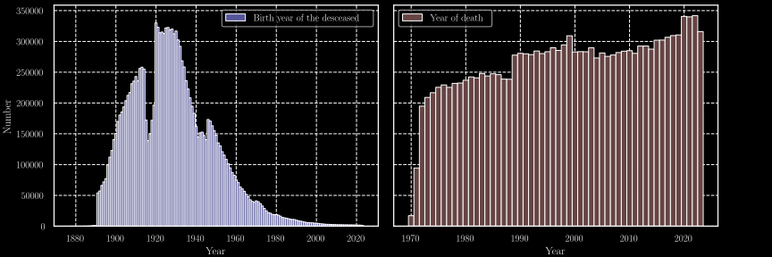
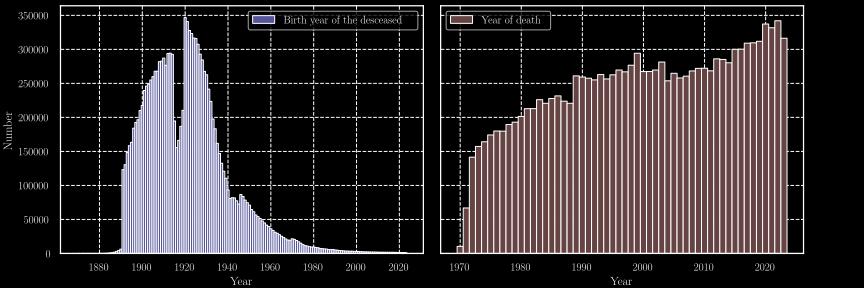
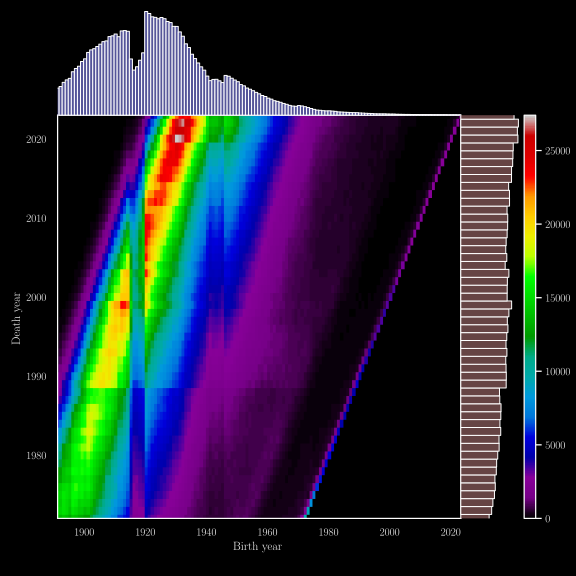
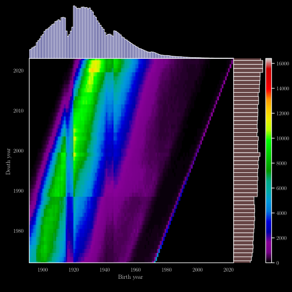
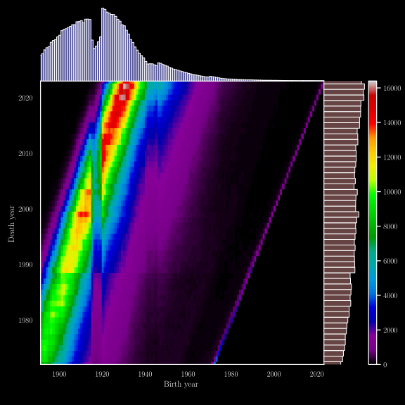

## Brief Overview of the Dataset

The dataset contains the following fields:

- Surname
- First name
- Gender
- Date of birth
- Code of the locality of birth
- Name of the locality of birth
- Country of birth
- Date of death
- Code of the locality of death
- Code of the death certificate

Using the years of birth and death, we can plot the distributions over time,
as shown in figures [@fig:dist; @fig:M_dist; @fig:F_dist].
The impact of the two world wars is evident in the reduced number of births during the periods 1915-1919 and 1940-1945.

{#fig:dist height=10% .center}

{#fig:M_dist height=10% .center}

{#fig:F_dist height=10% .center}

We can also observe the relationship between birth year and year of death in figures [@fig:2D_dist; @fig:M_2D_dist; @fig:F_2D_dist].
These figures display a line where the birth year matches the death year, which can be easily attributed to infant mortality. 

Another noteworthy aspect is the presence of a "death peak", which isn't surprising, as most people tend to die at an older age.
However, the dynamics of this peak are worth exploring further. The increase in life expectency is shown by this dynamic,
as the time goes the crest follows curve whose directive coeficient is above 1. Thus the gap between birth and death increase.

{#fig:2D_dist height=25%}

{#fig:M_2D_dist height=25%}

{#fig:F_2D_dist height=25%}

