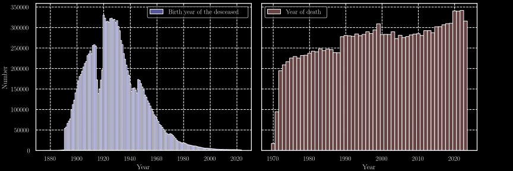

# Strange Years

This project involves parsing and analysing the French "Deceased Persons File" from the [INSEE](https://www.insee.fr) database.
We retrieved these datasets using the API from the [data.gouv.fr](https://www.data.gouv.fr) website.

## Introduction

This project is the culmination of a series of analyses that began during the second lockdown in France, 
from 30 October to 15 December 2020.
It initially stemmed from a casual discussion regarding the various arguments against the implementation of public health measures.
The argument that led us to examine the data was as follows:

> **"The excess mortality during the COVID-19 pandemic is comparable to the cold epidemics of previous years in France,
> which did not require lockdown measures. The response to COVID-19 is, therefore, at the very least, an overreaction."**

Following this discussion, we decided to use the skills we acquired during our physics studies to test this claim using data.
However, as we experimented with different data analysis and visualisation methods,
what started as a playful inquiry soon evolved into something much more profound than the initial question we had set out to answer.
New questions arose, and the following is the result of these explorations. 

This work is the product of discussions, aesthetic choices, and both insightful and less relevant observations.
It is a work focused on questions, more than answers.

> **"There are naive questions, tedious questions, ill-phrased questions,
> questions put forth after inadequate self-criticism. But every question is a cry to understand the world.
> There is no such thing as a dumb question."**
> 
> — *Carl Sagan, The Demon-Haunted World: Science as a Candle in the Dark*

## Brief overview of the dataset

The Data contains the following entries:

* Family name
* Name
* Gender 
* Date of birth
* Code of the locality of birth
* Name of the locality of birth
* Country of birth
* Date of death
* Code of the locality of birth
* Code of the death certificate

With the years of births and deaths, we can graphs the distributions through
time as shown in the [@fig:dist; @fig:M_dist; @fig:F_dist].
We can see the impact of the two world wars in numbers of births during the periods 1915-1919 and 1940-1945.

{#fig:dist height=10%}

{#fig:M_dist height=10%}

{#fig:F_dist height=10%}

We can also see the link between the birth year and the year of death, in the figures [@fig:2D_dist; @fig:M_2D_dist; @fig:F_2D_dist].
Thoses figures show a line when the year of birth match the year of death,
we can easily understand that infant mortality is the cause of of that structure in the figure.
Another interesting aspect is highlighted by the presence of a "mount of death",
nothing new about the fact that most of the population tend to die "old" but the dynamic of this mount is 

{#fig:2D_dist height=25%}

{#fig:M_2D_dist height=25%}

{#fig:F_2D_dist height=25%}

