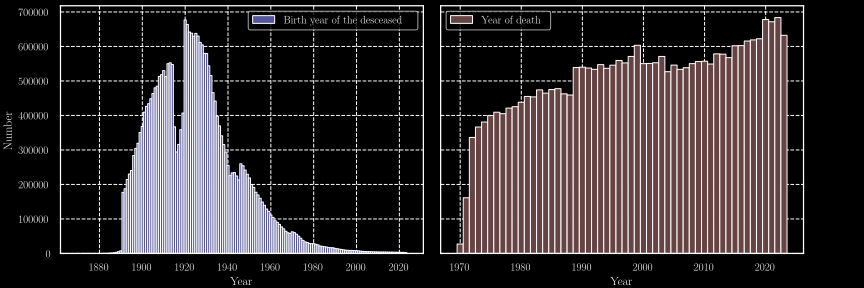

# Strange years
Here we parse and analyse the french "Deceased persons file" from the [INSEE](https://www.insee.fr) database.
We recover thoses datasets using the api of the [data.gouv.fr](https://www.data.gouv.fr) website.

## Brief overview of the dataset

The Data contains the following entries:

* Family name
* Name
* Gender 
* Date of birth
* Code of the locality of birth
* Name of the locality of birth
* Country of birth
* Date of death
* Code of the locality of birth
* Code of the death certificate

With the years of births and deaths, we can graphs the distributions through
time as shown in the [@fig:dist; @fig:M_dist; @fig:F_dist].
We can see the impact of the two world wars in numbers of births during the periods 1915-1919 and 1940-1945.

{#fig:dist height=10%}

{#fig:M_dist height=10%}

{#fig:F_dist height=10%}

We can also see the link between the birth year and the year of death, in the figures [@fig:2D_dist; @fig:M_2D_dist; @fig:F_2D_dist].
Thoses figures show a line when the year of birth match the year of death,
we can easily understand that infant mortality is the cause of of that structure in the figure.
Another interesting aspect is highlighted by the presence of a "mount of death",
nothing new about the fact that most of the population tend to die "old" but the dynamic of this mount is 

{#fig:2D_dist height=25%}

{#fig:M_2D_dist height=25%}

{#fig:F_2D_dist height=25%}

